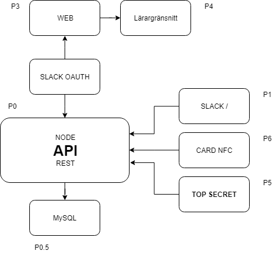

# Tidsapp av Happy Surfers

## RESTAPI

    POST /api/checkin
Check in with or without a specified project

---
    POST /api/checkout
Check out with or without a specified project

---
    POST /api/add
Add user to a project

---
    DELETE /api/remove
Remove a person from a project

---
    POST /api/new
Create a new project

---
    GET /api/project
Get information about a project

---
    POST /api/check
Check in or out (toggle)
Perhaps used on the website and via a card console reader (NFC)

```json
    /* REQUEST */
    {
        "card" | "user": 98349384 | 12,
        "token": "FA2837376AE6FF6FDC01DA0914F5013C0B2DAB1D"
    }

    /* RESPONSE */
    {
        "success": true, // If the check in was succesfull
        "write": false, // If the card was linked to an account
        "check_in": false, // If the action was a check in (otherwise check out)
        "name": "Olle Kaiser", // Full name of the user
        "timestamp": 1568631728330 
    }
```


## Slack / kommandon <required> [optional]

    /checkin [project name]
        Checking in to presence
        Checking in to presence and the project, if project name is provided
        Can be used to check out of a project and only in to presence if no project name is provided
        
    /checkout
        Check out of project and presence

    /new <name>
        Creates a new project with the name provided
        Also generates a new color associated with the project.

    /project <project name>
        Get information about the project, how many hours you have worked (today, this week, all time)

    /add <username> <project> 
        Add another user to one of your projects
        
    /remove <username> <project> 


## Diagram



## MySQL tables

**Important: When storing the date, store it in ms since epoch, ```Date.now()```**

#### Users
name | type | sepcial | description
--- | --- | --- | ---
id | int | AUTO_INCREMENT, PRI | ID of the user
username | text |none | User choosen name
name | text | none | Full name of the user
avatar | text | none | Link of the username
email | text | none | Email of the user
access_token | text | none | Access token given by slack, used to update user information
admin | int | none | Boolean(0-1) if the user is an admin or not.
created | BigInt | none | The date the user was created

#### Checks
name | type | sepcial | description
--- | --- | --- | ---
id | int | AUTO_INCREMENT, PRI | ID of the check
user | id |none | ID of the user
check_in | int | none | Boolean(0-1) if the it was a check in (otherwise check out)
project | text | NULL | Name of the project
date | BigInt | none | Date of the
type | text | none | Check in type (web, card, TOP SECRET)

#### Tokens

name | type | sepcial | description
--- | --- | --- | ---
id | int | AUTO_INCREMENT, PRI | ID of the token
user | id |none | ID of the user
token | text | none | Token

#### Projects

name | type | sepcial | description
--- | --- | --- | ---
id | int | AUTO_INCREMENT, PRI | ID of the project
name | text | none | Name of the project

#### Joints (table name subject to change ??)
List of who has joined what team and how much work they have done (in hours / minutes)

name | type | sepcial | description
--- | --- | --- | ---
id | int | AUTO_INCREMENT, PRI | ID of the joint
project | text | none | Name of the project
user | int | none | ID of the user
work | BigInt | none | Work done in ms (1 hour of work = 3600000)
date | BigInt | none | Date of joining the project